# Build Guide — Smart Vornado 660

A start-to-finish walkthrough for turning a stock push-button Vornado 660 into a
Home Assistant / HomeKit fan accessory using **button injection**: an ESP32
"presses" the fan's existing buttons through transistors. Nothing on the
mains/motor side is touched, and the mod is fully reversible.

> For *why* it's built this way (the electrical reasoning behind the transistors,
> the active-low button lines, the firmware state machine), see the
> [README](README.md). This guide is the *how*.

<p align="center">
  
  <br><em>The goal: this stock fan, controllable from Home Assistant, with no visible change.</em>
</p>

---

## ⚠️ Before you start

- **Unplug the fan** before opening it and keep it unplugged for all wiring work.
- The ESP32 is **not 5V-tolerant** (~3.6V absolute max on a GPIO). The transistors
  are what keep the 3.3V control side isolated from the fan's 5V button lines, so
  **do not** wire a GPIO straight to a button pad.
- Once the controller board is powered from the fan's 5V rail, **never also plug
  in USB at the same time.** On the DOIT DevKit, `VIN` and the USB 5V are tied
  together, so you'd back-feed your USB host.
- This is a reversible, low-voltage mod, but you are still working inside an
  appliance. If you're not comfortable identifying a ground rail with a
  multimeter, stop here.

**Difficulty:** intermediate soldering • **Time:** ~2–3 hours • **Reversible:** yes

---

## Parts & tools

### Parts

| Qty | Part | Notes |
|----|------|-------|
| 1 | Vornado 660 | Standard push-button model (not the AE/Alexa version) |
| 1 | ESP32-WROOM-32 DevKit, 30-pin | DOIT DevKit V1 layout |
| 5 | NPN BJT (PN2222 or S8050) | Interchangeable; both `E-B-C` with the flat face toward you |
| 5 | 1kΩ resistor | Base current limiting (one per channel) |
| 1 | Solderable proto board | One power rail used as the shared ground bus (an ElectroCookie rail board works well) |
| — | 28 AWG stranded silicone wire | Stranded survives vibration better than solid core |
| — | Foam / packing foam | Holds the finished board still inside the shell |

### Tools

- Soldering iron + solder
- Multimeter (continuity + DC volts), **required** for identifying the button lines
- Phillips screwdriver
- Helping-hands / PCB vise (makes the bench soldering far easier)
- Wire strippers, flush cutters

---

## Wiring schematics

### One channel (repeat ×5)

Each of the five buttons gets an identical NPN transistor wired as a **low-side
switch**. The ESP32 drives the base through a 1kΩ resistor; the transistor
saturates and pulls the button's signal line to ground, electrically identical
to a fingertip press.

```
Transistor pinout (flat face toward you, legs pointing down):

        ┌───────────┐
        │   (flat)  │
        │    NPN    │
        └─┬───┬───┬─┘
          E   B   C            E = Emitter  (left leg)
        left mid right         B = Base     (middle leg)
                               C = Collector(right leg)


  Single channel:

     ESP32 GPIOxx ──[ 1kΩ ]──► B (base)

                                C (collector) ──► fan BUTTON SIGNAL pad
                                E (emitter)   ──► shared GROUND bus

  Shared ground bus = ESP32 GND  +  fan button common/GND  +  all 5 emitters
```

The button line **idles HIGH (~4.89V, active-low)**. Pressing, or the transistor
firing, shorts it to ground, which the fan's controller reads as a press.

### Full system

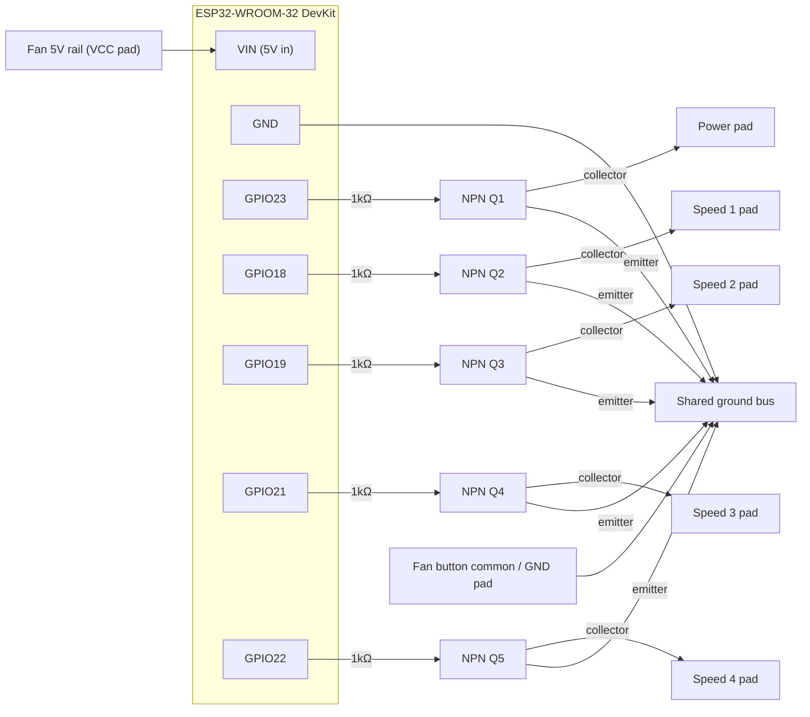
```mermaid
flowchart LR
    subgraph ESP["ESP32-WROOM-32 DevKit"]
        direction TB
        VIN["VIN (5V in)"]
        EGND["GND"]
        G23["GPIO23"]
        G18["GPIO18"]
        G19["GPIO19"]
        G21["GPIO21"]
        G22["GPIO22"]
    end

    G23 -- "1kΩ" --> Q1["NPN Q1"]
    G18 -- "1kΩ" --> Q2["NPN Q2"]
    G19 -- "1kΩ" --> Q3["NPN Q3"]
    G21 -- "1kΩ" --> Q4["NPN Q4"]
    G22 -- "1kΩ" --> Q5["NPN Q5"]

    Q1 -- "collector" --> P["Power pad"]
    Q2 -- "collector" --> S1["Speed 1 pad"]
    Q3 -- "collector" --> S2["Speed 2 pad"]
    Q4 -- "collector" --> S3["Speed 3 pad"]
    Q5 -- "collector" --> S4["Speed 4 pad"]

    Q1 -- "emitter" --> BUS["Shared ground bus"]
    Q2 -- "emitter" --> BUS
    Q3 -- "emitter" --> BUS
    Q4 -- "emitter" --> BUS
    Q5 -- "emitter" --> BUS

    EGND --> BUS
    FGND["Fan button common / GND pad"] --> BUS
    F5V["Fan 5V rail (VCC pad)"] --> VIN
```

### GPIO → button map

| GPIO | Silkscreen | Button |
|------|-----------|--------|
| GPIO23 | D23 | Power |
| GPIO18 | D18 | Speed 1 |
| GPIO19 | D19 | Speed 2 |
| GPIO21 | D21 | Speed 3 |
| GPIO22 | D22 | Speed 4 |

Pins chosen to avoid the ESP32's strapping, flash, and input-only pins.

> **Want a polished EDA schematic?** A Fritzing/KiCad version isn't included yet.
> If you build one, drop it in `media/` (e.g. `schematic-fritzing.png`) and link
> it here. PRs welcome.

---

## Step 1 — Build the controller board (bench work)

Do all of this on the bench **before** opening the fan. It's far easier to solder
and test in the open, and you want a known-good board before you commit to the
appliance.

**1a. Start with a bare proto board** and mount the ESP32. A rail-style proto
board is handy because one of its continuous power rails becomes your shared
ground bus.

<p align="center">
  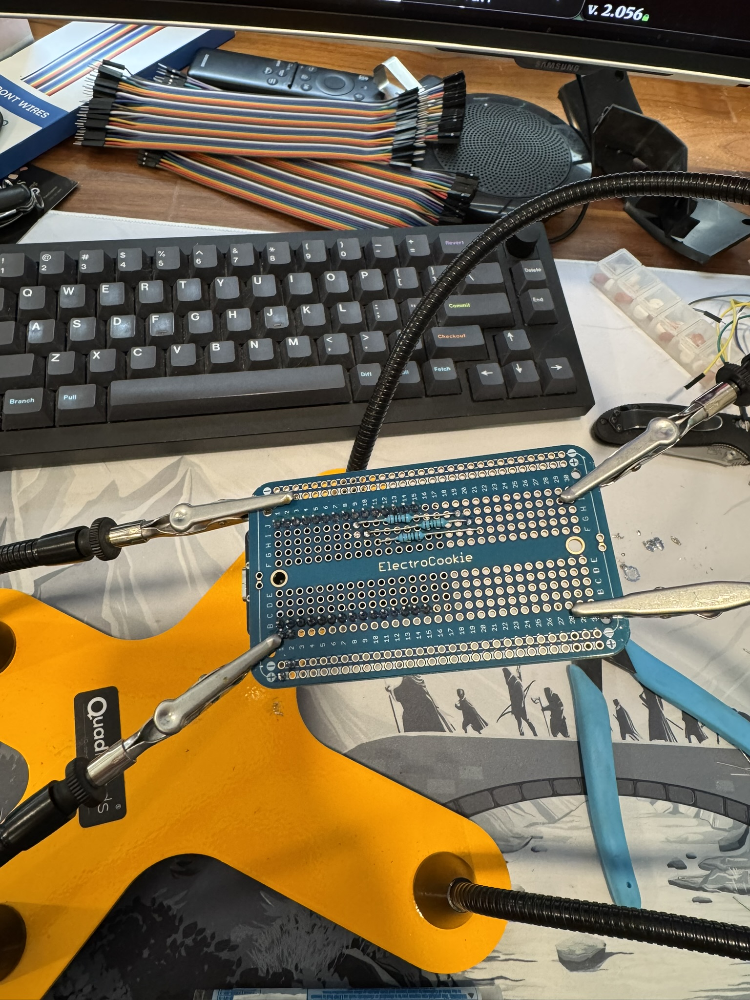
  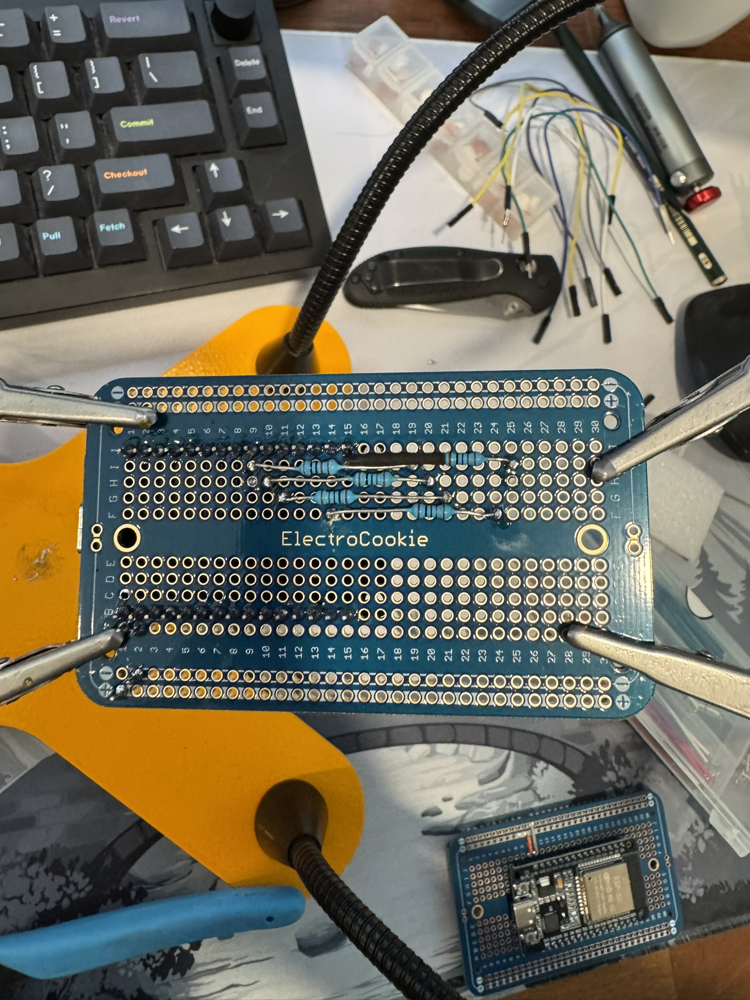
</p>

**1b. Solder the ESP32 to the board.** Seat it to one side so you leave room for
the five transistor channels and a tidy run of pads to the GPIOs.

<p align="center">
  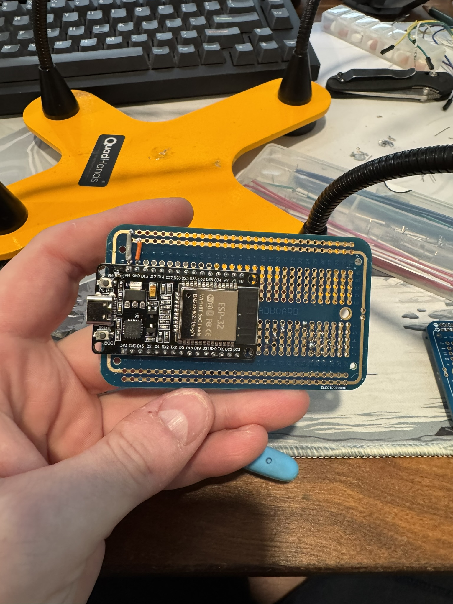
  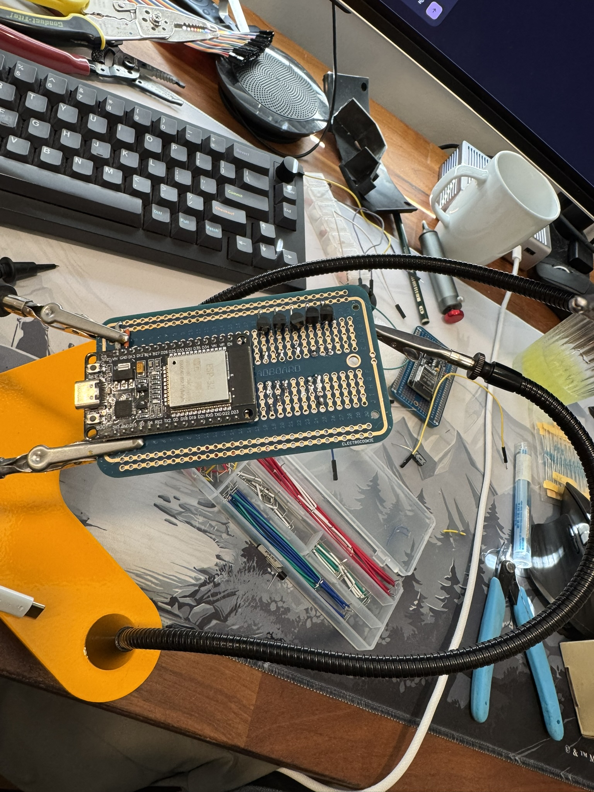
</p>

**1c. Install the five NPN transistors** in a row, all oriented the same way
(flat face the same direction so `E-B-C` is consistent). Each one is a channel.

<p align="center">
  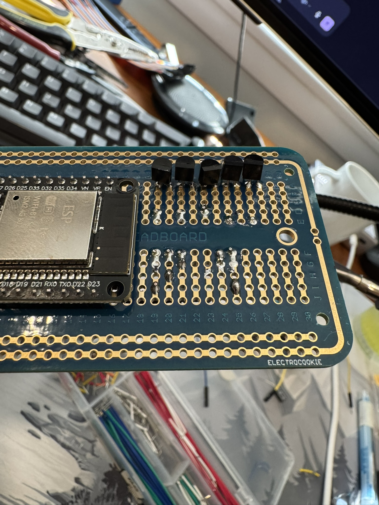
</p>

**1d. Wire each channel** on the solder side:

- **Base** of each transistor ← `1kΩ` resistor ← its GPIO (per the map above)
- **Emitter** of every transistor → the shared **ground rail**
- **Collector** of each transistor → a labeled flying lead (you'll solder these
  to the fan's button pads in Step 5)

Bring the ESP32 `GND` to the same ground rail. Keep the collector leads long
enough to reach comfortably and **label them** (Power, S1–S4). Guessing later,
inside the fan, is miserable.

<p align="center">
  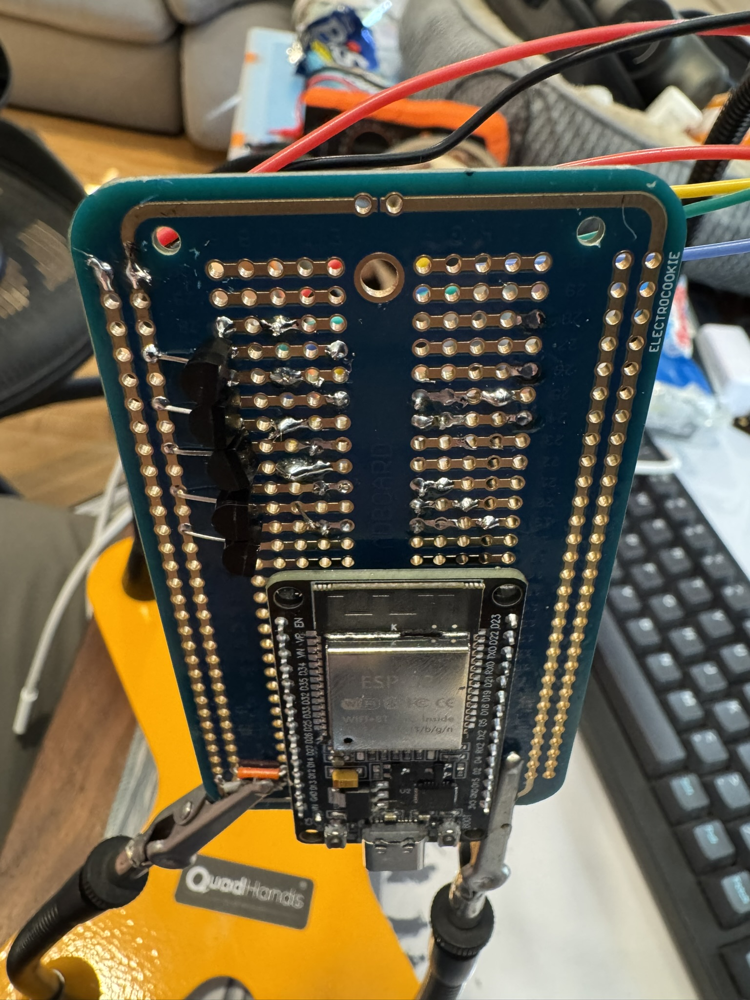
  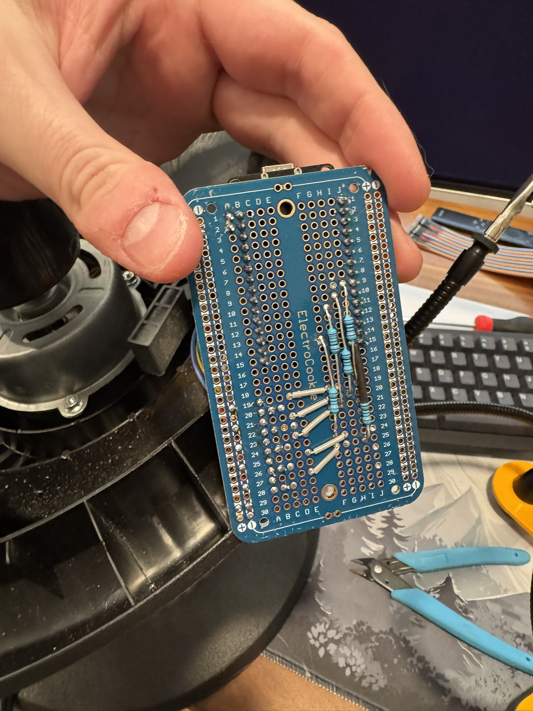
</p>

**1e. Add the wiring harness:** the GPIO/collector/power leads that will route
into the fan. Keep colors consistent so you can trace them blind later.

<p align="center">
  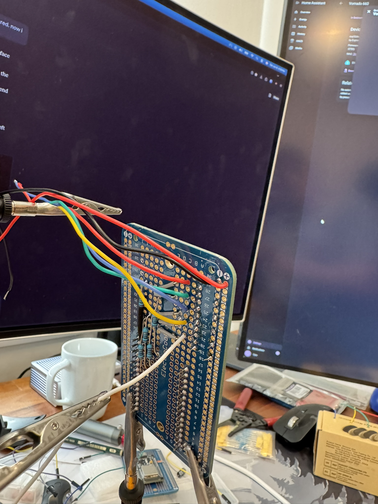
</p>

---

## Step 2 — First flash over USB

Flash and sanity-check the firmware **before** the board goes anywhere near the
fan, while USB is still safe to use (no 5V rail connected yet).

1. Install [ESPHome](https://esphome.io/) (`pip install esphome`, or the Home
   Assistant add-on).
2. Create your secrets file from the template:
   ```bash
   cp secrets.example.yaml secrets.yaml
   # edit secrets.yaml with your real WiFi SSID + password
   ```
   `secrets.yaml` is gitignored; it stays on your machine and is never committed.
3. Flash over USB:
   ```bash
   esphome run vornado-660.yaml
   ```
4. Confirm the node boots, joins WiFi, and shows up in Home Assistant as the
   **Vornado 660** fan entity. Test the speed slider; the collector leads aren't
   connected to anything yet, so nothing physical happens, but you can confirm the
   entity and the logs are healthy.

<p align="center">
  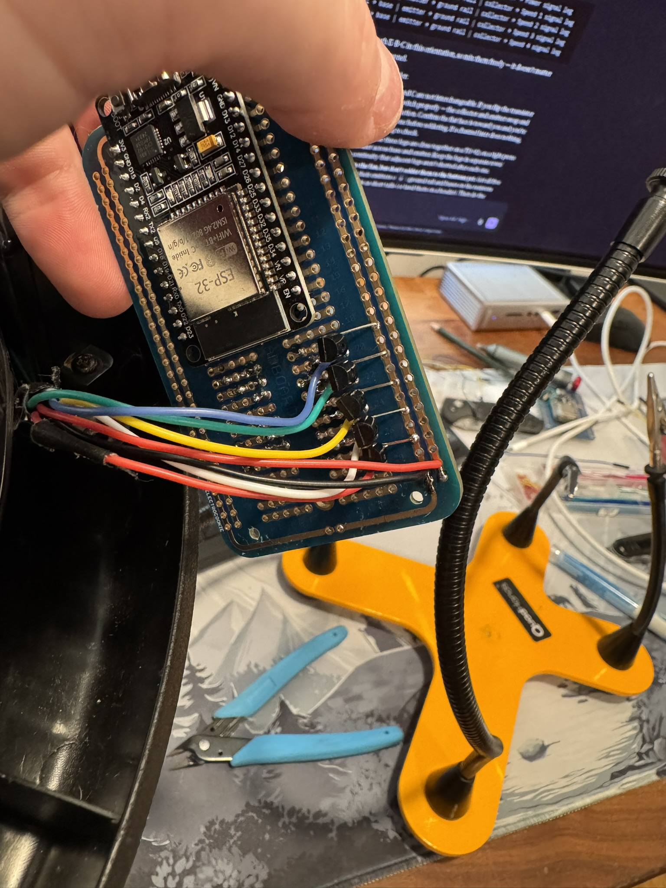
</p>

> After this first wired flash, **every future update is over-the-air.** You
> never have to open the fan again.

---

## Step 3 — Open the fan

**Unplug the fan first.**

Remove the screws holding the rear case together, then open the inner controller
box. The control electronics live in the head of the fan: two small green PCBs
(the button panels) wired to the controller, with the motor and cage behind them.
*(Keeping the teardown brief here: it's just case screws and the inner box; your
exact model's screw layout is self-evident once you're in.)*

<p align="center">
  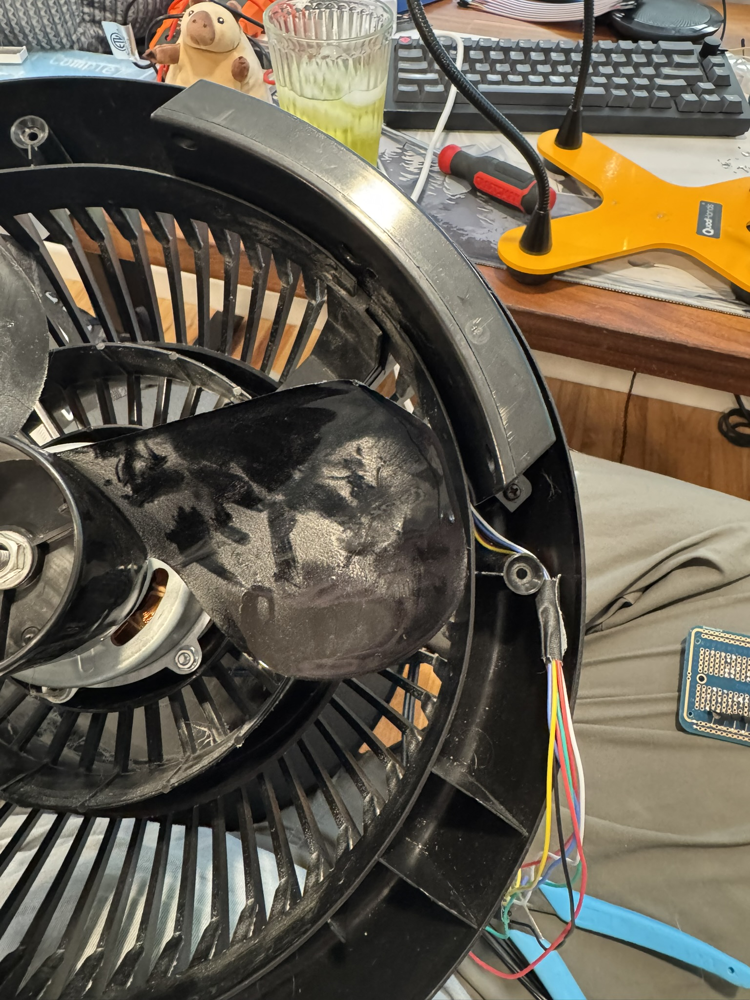
</p>

The button board lifts out enough to work on. Its back side carries the exposed
pads you'll be tapping.

---

## Step 4 — Identify the pads

The board has **exposed pads for every button**, plus **`VCC` and `GND`** pads for
power. You need to find, for each button, the **signal pad** (the leg that the
controller holds high) versus **common/ground**.

<p align="center">
  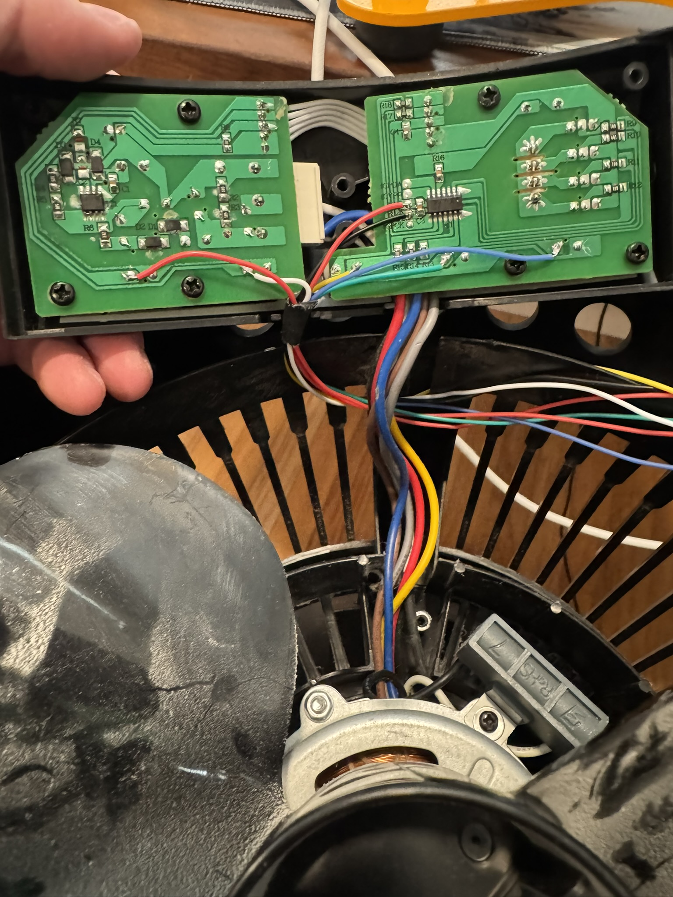
</p>

With the fan **plugged in briefly** and your multimeter in DC volts:

1. Black probe on a known ground (the `GND` pad or the button common rail).
2. Red probe on a button pad. The signal pad reads **~4.89V at idle** and drops to
   ~0V while you physically hold that button. That's your collector target.
3. Confirm `VCC` reads ~5V relative to `GND`. This is what will power the ESP32.

**Unplug again** before soldering.

> The fan has no status LED to read back, which is why the firmware tracks on/off
> in software rather than sensing it. Nothing to wire for that; just know the
> sync buttons in Home Assistant exist for when the tracked state drifts.

---

## Step 5 — Solder into the fan

With the fan unplugged:

- Solder each **collector lead** to its matching **button signal pad** (Power, S1–S4).
- Solder the **shared ground** (ESP32 GND + all emitters) to the fan's **button
  common / `GND` pad.** This is essential: the transistors must pull the button
  lines down to the *fan's own* ground reference.
- Solder the fan's **`VCC` (5V) pad → ESP32 `VIN`**, and you're powered from the
  fan's internal rail. Single cord, no second supply.

<p align="center">
  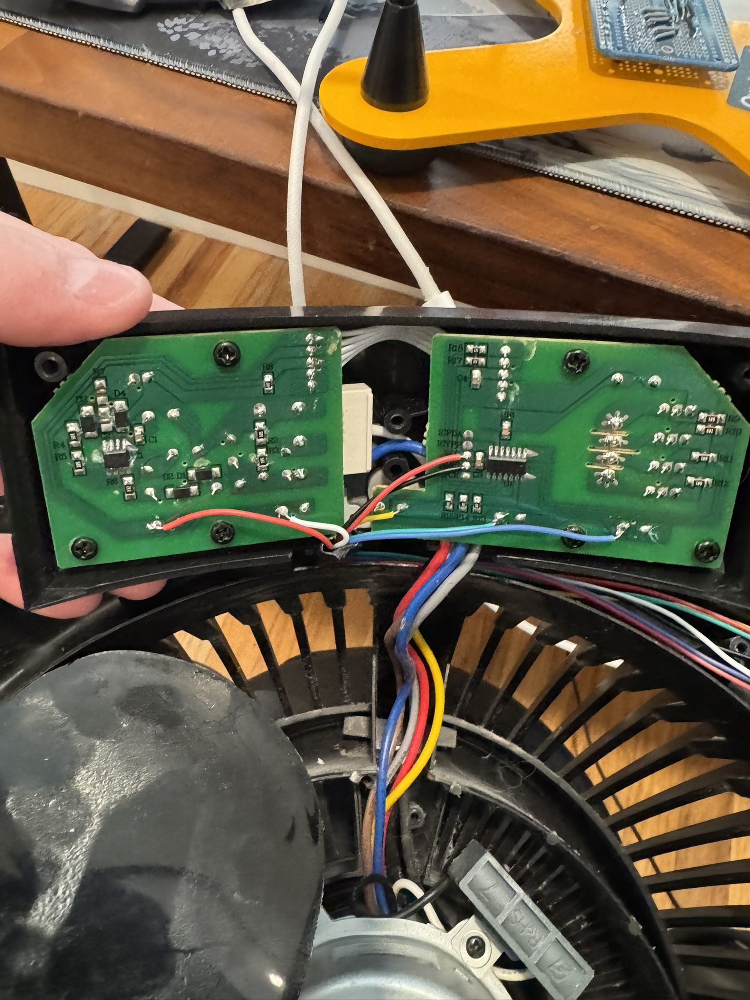
</p>

> **Rail headroom varies.** The 5V rail powers the ESP32 fine in this build, but if
> your board browns out the fan's controller under WiFi load, power the ESP32 from
> a separate USB supply instead (and then **don't** also feed `VIN`).

---

## Step 6 — Route the wires & mount the board

Route the harness **out through the bottom of the controller box, alongside the
wires already exiting there.** No new holes needed. Add a little strain relief
(a wrap of tape) so nothing tugs on your solder joints.

<p align="center">
  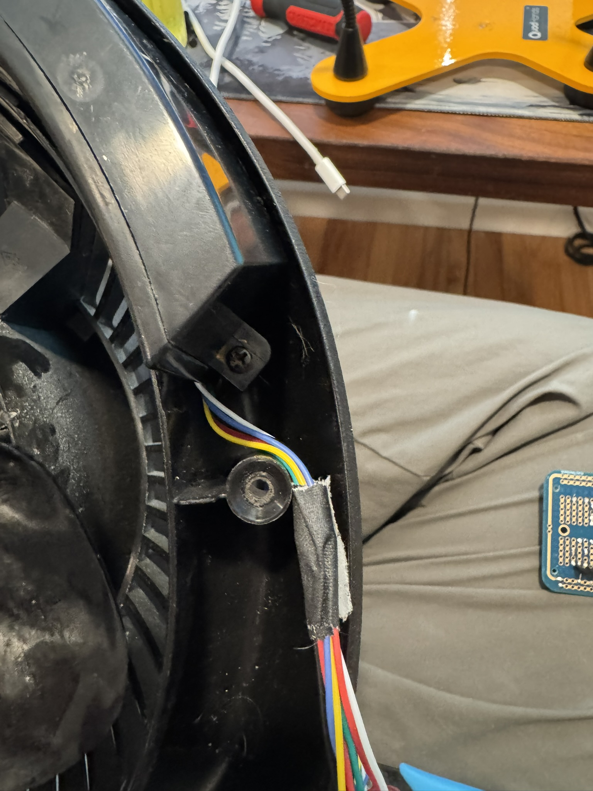
  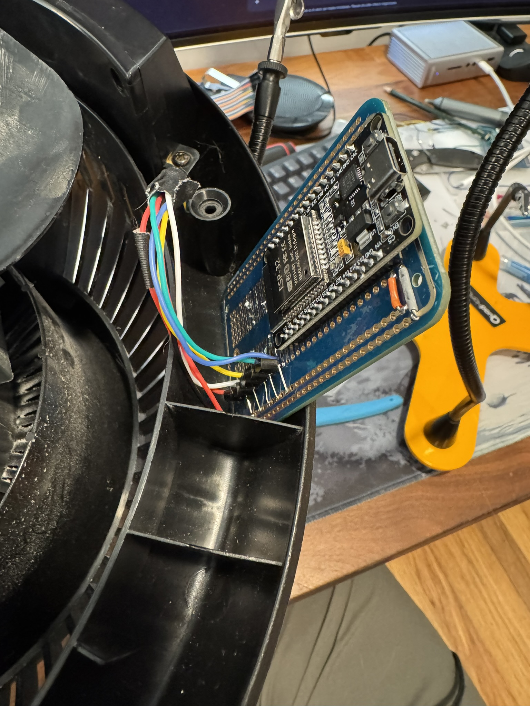
</p>

Tuck the controller board into empty space inside the body shell, off to one side,
and pack **foam** around it so it can't move or rattle against the housing.

---

## Step 7 — Reassemble & verify

Screw the case back together, plug in, and confirm in Home Assistant:

- **Toggle on/off.** The entity should press Power and the fan responds.
- **Set each speed 1–4.** Turning on from off presses Power, waits 400ms, then the
  speed; setting a speed while already running just changes speed.
- **Sync buttons** (HA-only): if the tracked state ever reads backwards from
  reality (e.g. someone used the physical buttons), use *Power Tap (raw)* or the
  *Sync: Fan Is Actually ON/OFF* buttons to realign without disturbing the fan.
- **Pull the plug and restore power.** The entity should come back **OFF**,
  matching the fan's hardware (the `on_boot` power-cycle detection handles this).

You should now see the fan in Home Assistant (and HomeKit):

<p align="center">
  
  
</p>

<p align="center">
  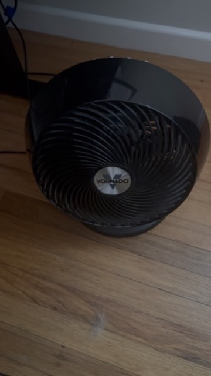
</p>

Done. From here on, firmware changes go out over-the-air. The fan stays closed.

---

## Troubleshooting

| Symptom | Likely cause | Fix |
|---------|-------------|-----|
| Nothing happens on a press | Collector on the wrong pad, or ground not shared with the fan | Re-confirm the signal pad with a multimeter; verify ESP32 GND ties to the fan's button common |
| ESP32 won't boot / damaged | GPIO wired straight to a 5V button line (no transistor) | The button line is ~4.89V; a transistor per channel is mandatory |
| Entity is on/off backwards | Physical buttons were used, desyncing software state | Press the matching *Sync: Fan Is Actually ON/OFF* button in HA |
| Fan controller resets under load | 5V rail can't supply the ESP32 + WiFi | Power the ESP32 from a separate USB supply (and don't also feed `VIN`) |
| Rapid taps merge into one | Press pulses overlapping | Already handled by the `queued` tap scripts (150ms pulse + 250ms gap); don't shorten them |
| USB host issues when plugged in | USB and `VIN`/fan 5V connected simultaneously | Use one power source at a time; they're tied together on this board |

---

## How the firmware behaves (quick reference)

The full config is in [`vornado-660.yaml`](vornado-660.yaml). Behavior the hardware forced:

- **Power-first:** a speed button does nothing until Power is pressed, so turn-on
  presses Power → waits 400ms → presses the speed.
- **Software state tracking:** no LED to sense, so on/off lives in a restored
  `fan_is_on` global; reliable as long as the fan is driven through HA.
- **Power-cycle detection:** `on_boot` reads the reset reason; a power-on/brownout
  forces state OFF (matching the hardware), a software reboot (OTA) trusts the
  saved value.
- **Queued taps:** each press is a 150ms pulse + 250ms release gap, queued so rapid
  commands register as distinct taps.
- **Recovery controls:** a raw Power tap and two sync buttons (HA-only) to correct
  drift without touching the fan.
