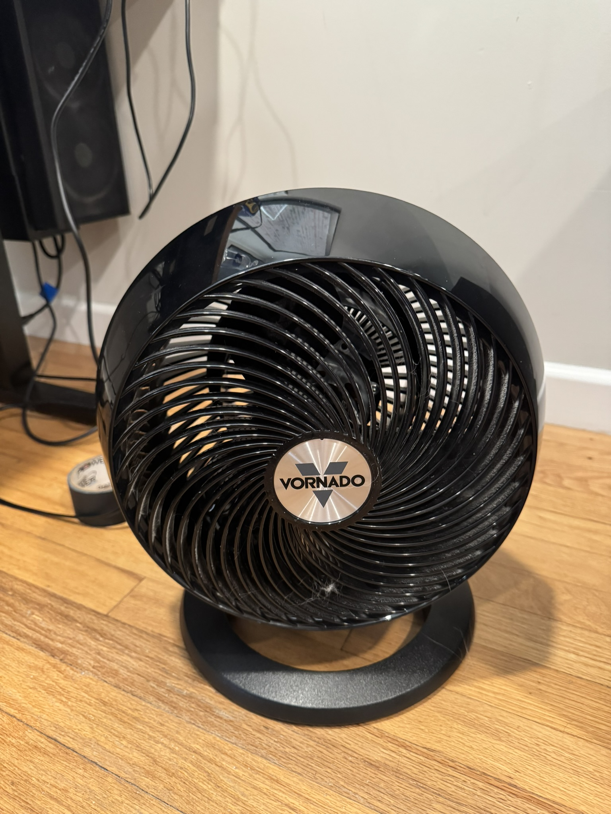
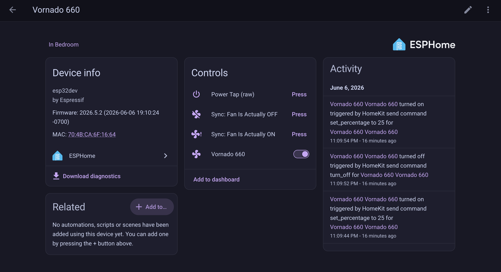
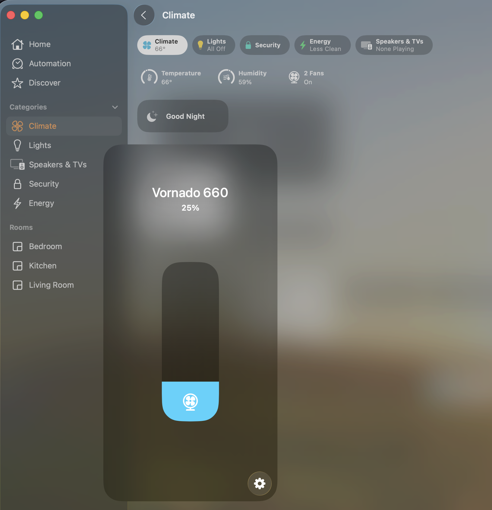

# Smart Vornado 660

I've had this Vornado 660 fan for years, it's rock solid and I love it. But I've automated most of my house, and it was annoying not being able to control the fan from my phone. I didn't want to replace a perfectly good fan, so I bought an ESP32 (\~$8) and a handful of transistors (\~$5) and did this mod instead.

Now it shows up in Home Assistant and HomeKit as a proper fan entity: toggle on/off, 4-step speed control, all over the network. The modification is entirely reversible. The fan's own electronics handle all the mains work; my board just emulates fingertip presses on the existing buttons via transistor "button injection."

The fan keeps doing all its own high-voltage work. The ESP32 just taps the buttons.

<p align="center">
  
</p>

> 🔧 **Want to build one?** See the step-by-step [**Build Guide → BUILD.md**](BUILD.md) for
> parts, wiring schematics, and photos for every stage.

## Result

A standard, non-smart Vornado 660 shows up in Home Assistant (and HomeKit) as a fan entity: toggle on/off, and a 4-step speed slider that maps to the fan's native speed buttons. Every reflash after the first is over-the-air. The fan never has to be opened again.

<p align="center">
  
  
</p>

## How it works

The 660's front panel is five momentary push buttons (Power, and speeds I–IV) feeding a logic-level controller. Each button is a 2-leg switch: one leg on a shared common rail (ground), the other on a signal line the controller holds high through an internal pull-up. Pressing a button shorts the signal line to ground; the controller reads that as a press. Measured idle voltage on the signal lines was **\~4.89V** (active-low, 5V logic).

To emulate a press, each button gets an **NPN transistor wired as a low-side switch** across it. The ESP32 drives the transistor base through a 1kΩ resistor; the transistor saturates and pulls the button's signal line to ground, electrically identical to a fingertip.

## Hardware

| Qty | Part | Notes |
|----|------|-------|
| 1 | Vornado 660 | Standard push-button model (not the AE/Alexa version) |
| 1 | ESP32-WROOM-32 DevKit, 30-pin | DOIT DevKit V1 layout |
| 5 | NPN BJT (PN2222 or S8050) | Interchangeable; both E-B-C with flat face toward you |
| 5 | 1kΩ resistor | Base current limiting |
| 1 | Solderable proto board | One power rail used as the shared ground bus |
| — | 28 AWG stranded silicone wire | Stranded for vibration tolerance |

Powered from the fan's internal 5V rail into the ESP32's `VIN` pin. Single cord, no second supply.

## Wiring

Five identical channels. Full schematics (single-channel and full-system diagram) are in the [Build Guide](BUILD.md#wiring-schematics). Per channel:

```
GPIO --[1kΩ]-- base (middle leg)
collector (right leg) --> button signal leg
emitter  (left leg)   --> shared ground rail
```

All five emitters, the ESP32 `GND`, and the fan's button common rail are one shared ground node, required so the transistors pull the button lines to the fan's own ground reference.

| GPIO | Silkscreen | Button |
|------|-----------|--------|
| GPIO23 | D23 | Power |
| GPIO18 | D18 | Speed 1 |
| GPIO19 | D19 | Speed 2 |
| GPIO21 | D21 | Speed 3 |
| GPIO22 | D22 | Speed 4 |

Pins chosen to avoid the ESP32's strapping, flash, and input-only pins.

Power: fan 5V → ESP32 `VIN`, fan GND → shared ground rail. **Never power from USB and VIN simultaneously.** On this board they're tied together and you'll back-feed the USB host.

## Firmware

ESPHome, modeled as a `fan` template entity with `speed_count: 4`. Full config in [`vornado-660.yaml`](vornado-660.yaml).

WiFi credentials are kept out of the config via ESPHome's `!secret` mechanism. Before flashing, copy the template and fill in your own network:

```bash
cp secrets.example.yaml secrets.yaml   # then edit secrets.yaml
esphome run vornado-660.yaml
```

`secrets.yaml` is gitignored and never committed.

A few decisions worth calling out, because the hardware forced them:

**Power-first state machine.** On this fan, a speed button does nothing until Power has been pressed first. So turning on (or setting a speed while off) presses Power, waits 400ms for the controller to wake, then presses the speed. Setting a speed while already on just presses the speed.

**Software state tracking.** The fan has no status LED to sense, so true on/off state can't be read back from hardware. State is tracked in a restored global (`fan_is_on`). This is reliable as long as the fan is driven through HA; using the physical buttons directly will desync it until the next command.

**Power-cycle detection on boot.** The fan hardware always returns to OFF after losing power. An `on_boot` hook reads the ESP32 reset reason: a power-on or brownout reset forces tracked state to OFF to match reality, while a software reboot (e.g. OTA) trusts the saved value. This keeps the entity honest across outages.

**Queued tap scripts.** Each "press" is a 150ms pulse with a trailing 250ms release gap, in `mode: queued`, so rapid commands register as distinct taps instead of merging into one long press (which the controller would misread).

**Recovery controls** (HA-only, kept out of the HomeKit filter): a raw single Power tap, plus two "sync" buttons that correct the tracked state without touching the fan, in case it ever drifts.

## Notes & limitations

- No hardware feedback means state is a best-effort software belief. The sync buttons exist for when that's not enough.
- The fan's 5V rail powers the ESP32 fine in this build, but rail headroom varies. If a board browns out the fan's controller under WiFi load, power the ESP32 from a separate USB supply instead.
- Don't commit `secrets.yaml` (WiFi credentials). It's gitignored; use `secrets.example.yaml` as the template.

## Why this approach

Button injection keeps the fan's own electronics responsible for everything mains-side. Nothing in the motor or power path is touched. The mod is entirely on the low-voltage logic side, reversible, and leaves the fan fully usable by hand.

## License

[MIT](LICENSE) © Tyler Rosnett. Build it, modify it, share it. Attribution appreciated.

This is a hobby modification of consumer hardware. It involves opening an appliance and working with its internals; do so at your own risk. Not affiliated with or endorsed by Vornado.